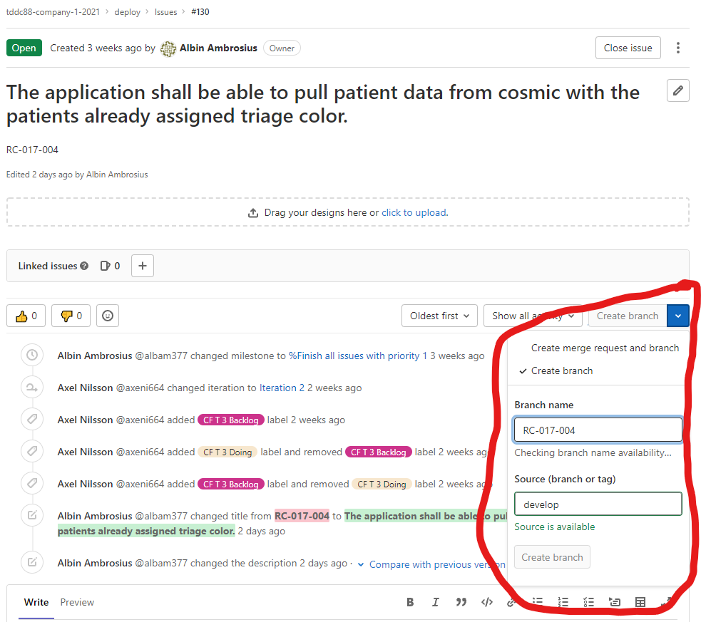

# TDDC88 Company 1 Project

## Semantic Commit Messages
In order to write meaningful commit messages, please use the following format:

`<type>: <subject>`, where the subject is a summary in present tense.

For example `docs: Update README.md`

More examples of types:
- `feat`: (new feature for the user, not a new feature for build script)
- `fix`: (bug fix for the user, not a fix to a build script)
- `docs`: (changes to the documentation)
- `style`: (formatting, missing semi colons, etc; no production code change)
- `refactor`: (refactoring production code, eg. renaming a variable)
- `test`: (adding missing tests, refactoring tests; no production code change)
- `chore`: (updating grunt tasks etc; no production code change)

Source: [Josh Buchea](https://gist.github.com/joshbuchea/6f47e86d2510bce28f8e7f42ae84c716)

## Workflow here on GitLab
_Last updated: 2021-11-05_

A sketch of the indended intial workflow is available in the image directory here in this repository.

**Until the end of iteration 2** - We have 5 long-lived branches:
- `main` - Is updated each iteration, code on this branch must be able to be shown to the customer. You are only allowed to pull code from develop to main.
- `develop` - The intermediate branch where code from backend, overview and dashboard should be merged to. Code on this branch must be ready to be tested (integration, regression and acceptance testing). Here it is fine to have some bugs.
- `backend` - CFT1
- `overview` - CFT2
- `dashboard` - CFT3

From the three cross-functional team branches, smaller feature branches shall be created. These smaller branches are not supposed to live longer than maximum two days, this is to enable continuous integration. When these smaller branches are merged to their respective CFT branch, peer-reviews must be made (see the section Approve Merge Requests below). All merge requests must be approved according to the set guidelines before it is merged (the author is prevented to approve). 

Before a merge request from a CFT branch to `develop` is made (or from a feature branch to a CFT branch), you must make sure that you have pulled the latest changes from `develop` to your branch and resolved the resulting conflicts if there are any.

**From iteration 3** - Use feature branches from issues:

The new workflow will not use the previous branches `backend`, `overview` and `dashboard` (but `main` and `develop` remain). When someone starts to work on a new feature, they should branch out directly from `develop`. To keep everything connected with our requirements, create your new branch from the related issue in the requirement list here on GitLab.

So if you want to work on features related to for example requirment RC-017-004, you go to the issue (for example by searching for the id in the issue list) and use the option "Create branch". Name the branch the id of the requirement, in this case "RC-017-004". The source shall in most cases be `develop`.

    

## Merge requests
_Last updated: 2021-11-05_

Our primary way to incorporate code from one branch to another is through merge requests. Make sure to follow the steps below when either creating merge requests or approving them.

### Creating Merge Requests

**Title** - make sure to choose a suitable title. Think of this as a short summary where you will not need any other documentation to understand what it is about. 

**Description** - fill in the provided template. Answer the questions:

- Which requirements do this merge relate to?
- What features have been added?
- What to test when reviewing?
- Intended behavior?

If anything else needs to be added, feel free to add it below the template.

**Assignees & Reviewers** - the assignee is responsible for creating or merging the merge request. The reviewer will do the peer-review (see Approving Merge Requests) and is responsible of approving the merge if it passes the review. In our project, the author is not allowed to approve a merge request. Therefore the reviewer should be a team member who has not worked with the code. It is fine to assign both yourself and the reviewer as assignees. Click [here](https://docs.gitlab.com/ee/user/project/merge_requests/getting_started.html#assignee) for more details about the differences between assignees and reviewers in GitLab.

In addition to the peer-review, a member from the test team need to approve the merge. Currently, only Jacob Karlén is allowed to approve merges with the main branch.

**Milestone** - leave empty for now. Milestones on GitLab are not defined yet.

**Labels** - add suitable label for the merge request (or talk with Albin Ambrosius about creating one).

**Merge request dependecies** - add which requests needs to be merged before this one (if any).

**Merge options** - make sure that you do **not** select "Delete source branch when merge request is accepted" when merging from `develop`, `backend`, `overview` or `dashboard`. Smaller feature branches should be deleted (they should be small enough to be deleted when merged).

### Approving Merge Requests
Rules:

- A peer-review has to be done with someone who has not worked with the code.
- A peer-review must not exceed one hour.
- A merge request must be handled within two working days from when the merge request was posted. 

Checklist:

- Have the author answered all the questions in the template?
If not, comment what is missing. The answers to the questions are helpful for the documentation process so do not approve the merge until the answers are sufficient. 
- Look through the commits. Are they written according to the decided format (see Semantic Commit Messages above)?
If not, leave a comment to remind the author to follow the guidelines going forward.
- Look through the changes. Is the code following the [style guide](https://google.github.io/styleguide/tsguide.html)? Are the names of variables and functions self-explanatory and intuitive? Are all new functions sufficiently described with comments?
If not, leave comments in the code where you found the issue and define what needs to be changed. Please write which lines the comment applies to in the comment, it is not always that clear even if the function "Commenting on lines ..." is used, and use the "Insert suggestion" function if you have a suggested solution.
- Test what the author wanted you to test. Comment when necessary.
- Based on the changes made, investigate quickly whether any related function may have been affected by the changes and test it (further testing will be made by the test team).
If the changes resulted in a major diffence in functionality or a bug, comment and make sure the problem is resolved before merging.
- For requirements marked _Done_: Check if the indended behavior corresponds with the behavior described in the use case which the requirement was derived from.
If the behavior does not correspond, comment what differs.

At a later stage we plan to introduce pipelines to test the code (this is not ready yet), but for now the assigned approver need to test the code manually.

Make sure that all comments are addressed before merging!

## Installation
The development environment is set up using docker. Download docker [here](https://docs.docker.com/get-docker/).

### Follow the steps below
Clone repository
```
git clone git@gitlab.liu.se:tddc88-company-1-2021/deploy.git tddc88-project
```
Create and checkout branch develop and pull source code
```
git checkout -b develop
git pull origin develop
````

Run the development environment with the following command in the project root:
```
docker-compose -f docker-compose.dev.yml up --build
```

This will spin up three docker containers with Angular (port 4200), Node.js (port 8080), and MongoDB (port 27017).
